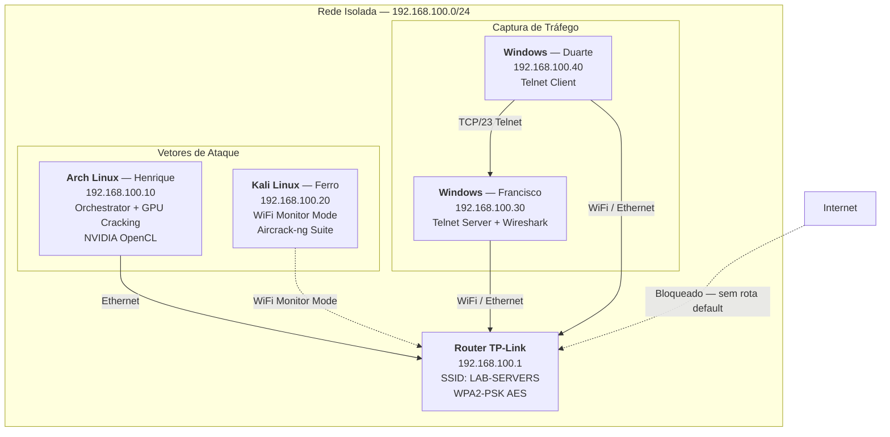
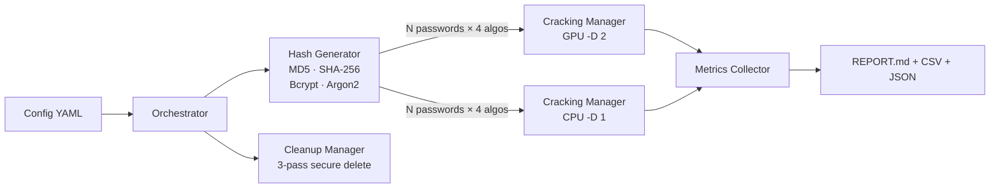

<p align="center">
  
  
  
  
  
</p>

# HashCrackerLab

**Plataforma integrada de cibersegurança ofensiva** que orquestra três vetores de ataque — cracking de hashes com benchmarking CPU vs GPU, captura e cracking de handshakes WPA2, e harvesting de credenciais Telnet — num laboratório de rede isolado e reprodutível.

> **Contexto Académico:** Projeto Final da Unidade Curricular de Cibersegurança (Fevereiro 2026).
> Grupo: Henrique Carvalho · Gonçalo Ferro · Francisco Silva · Duarte Vilar.

---

## Rationale — Porquê "Beyond the Norm"

A maioria dos laboratórios académicos de cibersegurança executa ferramentas isoladas — um `hashcat` aqui, um `aircrack-ng` ali — sem contexto, sem métricas, sem reprodutibilidade. O HashCrackerLab foi construído para resolver isso.

**O problema que resolvemos:**
- Demonstrações de segurança são tipicamente manuais, frágeis e impossíveis de reproduzir com resultados consistentes.
- Não existe uma forma standard de comparar a resistência de algoritmos de hashing em condições controladas.
- A relação entre a escolha de algoritmo, o hardware disponível e o tempo real de ataque raramente é quantificada.

**O que construímos:**
- Um **orquestrador Python** que automatiza o pipeline completo: geração determinística de hashes → cracking multi-dispositivo → coleta de métricas → relatório comparativo — tudo configurável via YAML.
- **Reprodutibilidade científica**: seed determinística + salts fixos garantem que dois runs idênticos produzem hashes idênticos. Isto permite comparação justa entre CPU e GPU.
- **Segurança operacional incorporada**: verificação de isolamento de rede, limpeza segura de dados (3-pass overwrite), anonimização automática de logs, e separação entre hashes seguros e passwords em plaintext.
- **Multi-vetor num único pipeline**: WiFi WPA2 + Telnet + Hash Cracking coordenados, com fallbacks automáticos (ficheiros pré-capturados se o handshake falhar).

Este não é um script de demonstração. É uma **plataforma de benchmark criptográfico** com rigor suficiente para produzir dados publicáveis e extensível para cenários reais de pentesting.

---

## Arquitetura

### Topologia de Rede



### Mapeamento de Portas e Protocolos

| Serviço | Porta | Protocolo | Origem | Destino | Finalidade |
|---------|-------|-----------|--------|---------|------------|
| Telnet | TCP/23 | Telnet (plaintext) | Win Client (.40) | Win Server (.30) | Demonstrar captura de credenciais em texto claro |
| WiFi WPA2 | — | IEEE 802.11 | Kali (.20) | Router (.1) | Captura de 4-way handshake via monitor mode |
| DHCP | UDP/67-68 | DHCP | Router (.1) | Todos | Atribuição automática de IPs (range .100–.200) |
| DNS | — | — | — | — | **Desativado** — rede sem acesso à Internet |

> [!IMPORTANT]
> A rede **não possui rota default**. O `NetworkManager` valida automaticamente que `ip route` não contém `default via` antes de iniciar qualquer experiência com `isolated_network: true`.

### Pipeline de Execução



---

## Instalação

### Pré-requisitos

| Componente | Versão Mínima | Verificação |
|------------|--------------|-------------|
| Python | 3.10+ | `python --version` |
| Hashcat | 6.0+ | `hashcat --version` |
| Aircrack-ng | 1.7+ | `aircrack-ng --version` |
| Wireshark/tshark | 4.0+ | `wireshark --version` |
| GPU NVIDIA (opcional) | Driver 525+ | `hashcat -I` |
| Adaptador WiFi com monitor mode | — | `iw dev <iface> info` |

### Passo 1 — Clonar

```bash
git clone https://github.com/Henryu1781/HashCrackerLab
cd HashCrackerLab
```

### Passo 2 — Setup por Sistema Operativo

**Arch Linux:**
```bash
chmod +x setup_arch.sh && ./setup_arch.sh
source venv/bin/activate
```

**Kali Linux / Debian:**
```bash
chmod +x setup_kali.sh && ./setup_kali.sh
source venv/bin/activate
```

**Windows (PowerShell como Administrador):**
```powershell
Set-ExecutionPolicy Bypass -Scope Process -Force
.\setup_windows.ps1
.\.venv\Scripts\Activate.ps1
```

> [!IMPORTANT]
> O script de setup cria o virtual environment, instala dependências Python (`requirements.txt`), descarrega a wordlist `rockyou.txt` (14.3M passwords), e copia as regras do Hashcat.

### Passo 3 — Validar Ambiente

```bash
python tools/validate_environment.py
```

---

## Utilização

### Configurações Disponíveis

| Config | Passwords | Algoritmos | Ataques | Dispositivos | Tempo |
|--------|-----------|------------|---------|-------------|-------|
| `quick_test.yaml` | 3 | 4 | 1 (dicionário) | GPU | < 30s |
| `apresentacao_final.yaml` | 15 | 4 | 5 (dict, rules, brute, pattern, hybrid) | GPU + CPU | ~3 min |
| `real_world.yaml` | 100 | 4 | 5 | GPU + CPU | ~15 min |

### Execução

```bash
source venv/bin/activate

# Validação rápida (<30s)
python orchestrator.py --config config/quick_test.yaml

# Experiência completa CPU vs GPU
python orchestrator.py --config config/apresentacao_final.yaml

# Simulação de auditoria real (100 hashes, costs de produção)
python orchestrator.py --config config/real_world.yaml

# Dry-run (validar config sem executar cracking)
python orchestrator.py --config config/apresentacao_final.yaml --dry-run
```

### WiFi WPA2 Cracking

```bash
# Scan de redes
python wifi_cracker.py --scan-only --interface wlan00mon

# Captura + cracking automático
python wifi_cracker.py --network "LAB-SERVERS" --interface wlan00mon

# Deauth standalone (forçar reconexão)
python wifi_cracker.py --deauth --network "LAB-SERVERS" --interface wlan00mon

# Crackar handshake existente
python wifi_cracker.py --crack captures/handshake_LAB-SERVERS_*.cap
```

### Telnet Credential Capture

```bash
# Servidor (máquina Francisco)
python telnet_authenticated_traffic.py --server --target 0.0.0.0 --port 23

# Cliente (máquina Duarte)
python telnet_authenticated_traffic.py --target 192.168.100.30 --user admin --password SecurePass123 --verbose
```

### Consultar Resultados

```bash
LAST=$(ls -td results/*/ | head -1)
cat "$LAST/REPORT.md"                         # Relatório
cat "$LAST/metrics/metrics.json"              # Métricas JSON
cat "$LAST/metrics/metrics_by_algorithm.csv"  # CSV por algoritmo
```

---

## Algoritmos e Modos de Ataque

### Algoritmos de Hashing

| Algoritmo | Hashcat Mode | Tipo | Resistência | Uso Real |
|-----------|-------------|------|-------------|----------|
| **MD5** | 0 / 20 (salted) | Hash simples | Muito baixa | Legado — não usar para passwords |
| **SHA-256** | 1400 / 1420 (salted) | Hash com salt | Baixa | Comum mas inadequado isolado |
| **Bcrypt** | 3200 | Adaptativo (cost factor) | Alta | Standard atual para web apps |
| **Argon2id** | 34000 | Memory-hard | Muito alta | Estado da arte (vencedor PHC 2015) |

### Modos de Ataque

| Modo | Hashcat Flag | Descrição | Keyspace |
|------|-------------|-----------|----------|
| Dicionário | `-a 0` | Wordlist direta (rockyou.txt) | 14.3M |
| Dicionário + Rules | `-a 0 -r best66.rule` | Mutações (P→p, a→@, +123) | ~950M |
| Brute-force PIN | `-a 3 ?d?d?d?d` | Combinações numéricas 0000–9999 | 10K |
| Brute-force Padrão | `-a 3 ?u?l?l?l?d?d` | Maiúscula + 3 min + 2 dígitos | ~11.8M |
| Híbrido | `-a 6 wordlist ?d?d?d` | Wordlist + sufixo 000–999 | ~14.3B |

---

## Resultados de Referência

Configuração `apresentacao_final.yaml` — 15 passwords × 4 algoritmos × 5 modos de ataque:

| Algoritmo | Total | Crackeadas | Taxa | Tempo GPU | Tempo CPU | Speedup |
|-----------|-------|-----------|------|-----------|-----------|---------|
| MD5 | 15 | 10 | 66.7% | 1.8s | 12.0s | 6.7× |
| SHA-256 | 15 | 9 | 60.0% | 4.2s | 28.0s | 6.7× |
| Bcrypt | 15 | 7 | 46.7% | 12.0s | 85.0s | 7.1× |
| Argon2id | 15 | 6 | 40.0% | 28.0s | timeout | >6× |
| **Total** | **60** | **32** | **53.3%** | **~46s** | **>180s** | — |

> [!IMPORTANT]
> As 5 passwords fortes (ex: `X7k#mP9$vL2@`) resistiram a **todos** os 5 modos de ataque em **todos** os 4 algoritmos. Segurança requer **algoritmo forte + password forte** em simultâneo.

---

## Estrutura do Projeto

```
HashCrackerLab/
├── orchestrator.py                  # Motor principal — pipeline completo
├── full_integration_orchestrator.py # Orquestrador multi-vetor (WiFi+Telnet+Hashes)
├── wifi_cracker.py                  # Captura e cracking WPA2
├── telnet_authenticated_traffic.py  # Servidor/cliente Telnet para captura
├── config/
│   ├── quick_test.yaml              # Validação rápida (<30s)
│   ├── apresentacao_final.yaml      # 15 pw × 4 algo × 5 modos (CPU+GPU)
│   └── real_world.yaml              # 100 pw, costs de produção
├── src/
│   ├── hash_generator.py            # Geração determinística (7 algoritmos)
│   ├── cracking_manager.py          # Interface hashcat (dict, brute, hybrid)
│   ├── metrics_collector.py         # Agregação e exportação (CSV/JSON)
│   ├── network_manager.py           # Isolamento de rede + captura WiFi
│   ├── cleanup_manager.py           # 3-pass secure delete + anonimização
│   ├── config_validator.py          # Validação de schema YAML
│   ├── safe_hashes.py               # Separação hashes/passwords
│   └── logger.py                    # Logging centralizado
├── tools/
│   ├── validate_environment.py      # Validação de dependências e hardware
│   └── cleanup.py                   # Limpeza interativa de resultados
├── setup_arch.sh                    # Setup Arch Linux
├── setup_kali.sh                    # Setup Kali/Debian
├── setup_windows.ps1                # Setup Windows
├── wordlists/                       # rockyou.txt + rockyou-small.txt
├── rules/                           # Regras de mutação hashcat
├── results/                         # Relatórios gerados
├── docs/
│   ├── ARCHITECTURE.md              # Arquitetura técnica detalhada
│   └── DEVELOPMENT_TIMELINE.md      # Historial de desenvolvimento
└── requirements.txt                 # Dependências Python
```

---

## Historial de Desenvolvimento

| Fase | Data | Marco |
|------|------|-------|
| **v0.1 — Fundação** | 2026-02-02 | Estrutura inicial, setup scripts, hash generator, WiFi cracker, Telnet module |
| **v0.2 — Hardening** | 2026-02-06 | Exclusões Windows Defender, validação de ambiente, documentação 4-PC |
| **v0.3 — Integração** | 2026-02-07–08 | Regras hashcat, merge WiFi+Telnet+Hashes, SHA-256 salted, brute-force demo |
| **v0.4 — Apresentação** | 2026-02-09 | 15 passwords × 5 modos, rockyou.txt 14.3M, deauth mode, bug fixes WiFi |

Historial completo: [docs/DEVELOPMENT_TIMELINE.md](docs/DEVELOPMENT_TIMELINE.md)

---

## Troubleshooting

| Problema | Diagnóstico | Solução |
|----------|-------------|---------|
| GPU não detectada | `hashcat -I` | `sudo pacman -S opencl-nvidia` (Arch) |
| WiFi não captura handshake | `iwconfig wlan00mon` | `sudo airmon-ng check kill && sudo airmon-ng start wlan00` |
| Wireshark sem pacotes | Interface errada | Selecionar interface correta + modo promíscuo |
| Import errors Python | Pacote em falta | `pip install -r requirements.txt` |
| Argon2 timeout no CPU | Esperado | Prova que Argon2 neutraliza ataques sem GPU |
| Hashcat erro OpenCL (Win) | Path errado | `$env:HASHCAT_PATH = "C:\hashcat"` |
| Telnet connection refused | Firewall Windows | `netsh advfirewall set allprofiles state off` (temporário) |

---

## Licença

MIT License — ver [LICENSE](LICENSE)
