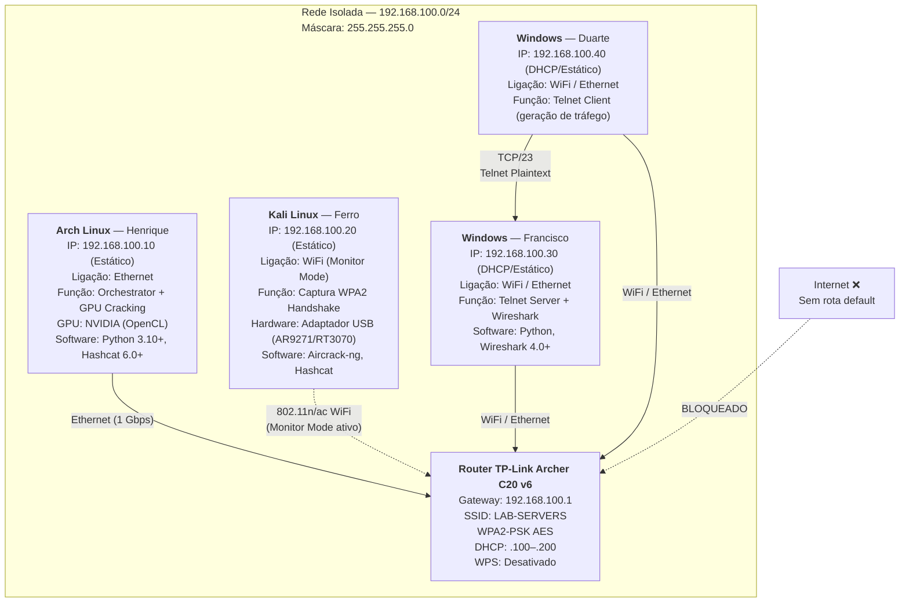
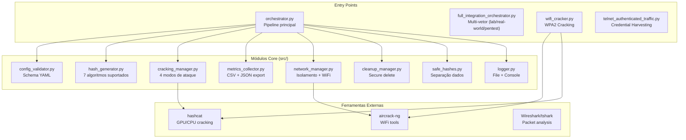
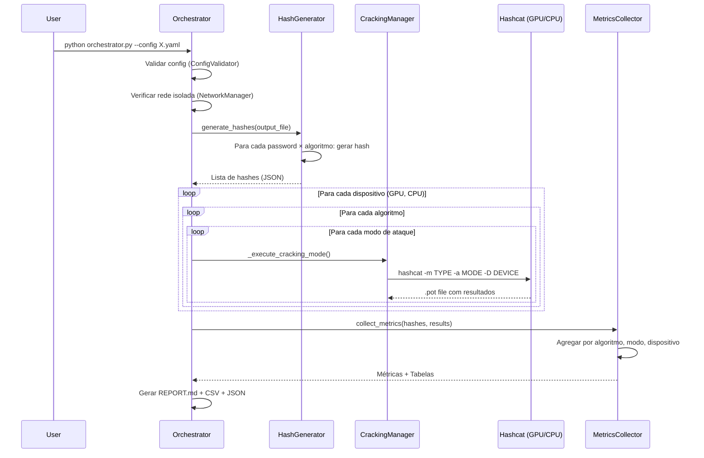
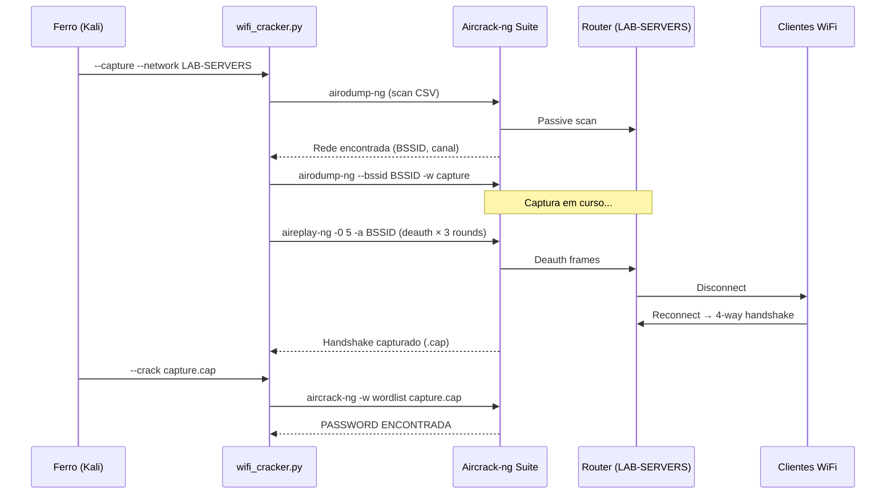

# Arquitetura Técnica — HashCrackerLab

Documentação detalhada da arquitetura de rede, componentes de software e fluxos de dados do laboratório.

---

## Topologia de Rede

### Diagrama Completo



### Endereçamento IP

| Dispositivo | IP | MAC (exemplo) | Ligação | Função |
|-------------|-----|---------------|---------|--------|
| Router (Gateway) | 192.168.100.1 | — | — | Access Point + DHCP Server |
| Henrique (Arch) | 192.168.100.10 | — | Ethernet | Orchestrator + GPU Cracking |
| Ferro (Kali) | 192.168.100.20 | — | WiFi (wlan00mon) | WiFi Pentesting |
| Francisco (Win) | 192.168.100.30 | — | WiFi / Ethernet | Telnet Server + Wireshark |
| Duarte (Win) | 192.168.100.40 | — | WiFi / Ethernet | Telnet Client |
| DHCP Pool | 192.168.100.100–200 | — | — | Clientes dinâmicos |

### Portas e Protocolos Ativos

| Serviço | Porta | Protocolo | Direção | Encriptação | Observação |
|---------|-------|-----------|---------|-------------|------------|
| Telnet | TCP/23 | Telnet | .40 → .30 | **Nenhuma** (plaintext) | Intencional — demonstrar vulnerabilidade |
| WiFi | — | 802.11 WPA2 | Kali ↔ Router | AES-CCMP | Handshake capturado via monitor mode |
| DHCP | UDP/67-68 | DHCP | Router → Todos | Nenhuma | Range: .100–.200 |
| HTTP (admin) | TCP/80 | HTTP | Qualquer → Router | Nenhuma | Painel admin do router (192.168.100.1) |

> [!IMPORTANT]
> **Isolamento de rede**: Não existe rota default (`ip route del default`). O `NetworkManager` do orquestrador valida isto programaticamente antes de cada run. Nenhum tráfego sai da subrede 192.168.100.0/24.

---

## Componentes de Software

### Diagrama de Componentes



### Módulos Detalhados

#### `orchestrator.py` — Motor Principal

Coordena o pipeline completo: validação → geração → cracking → métricas → relatório → limpeza.

| Fase | Componente | Operação |
|------|-----------|----------|
| 1/6 | `NetworkManager` | Verificar isolamento de rede (se configurado) |
| 2/6 | `HashGenerator` | Gerar N × M hashes (N passwords × M algoritmos) |
| 3/6 | `CrackingManager` | Executar K modos de ataque em cada dispositivo (GPU/CPU) |
| 4/6 | `MetricsCollector` | Agregar resultados por algoritmo, modo e dispositivo |
| 5/6 | `_generate_report()` | Exportar REPORT.md + CSV + JSON |
| 6/6 | `CleanupManager` | Limpeza segura (se `auto_cleanup: true`) |

Extras (pós-cracking):
- **WPA2 GPU Demo**: benchmark de hashcat mode 22000 contra `hashes/wifi_sample.hc22000`
- **Brute-force Concept**: simulação visual de PIN 0000–9999 em Python

#### `hash_generator.py` — Gerador Determinístico

Suporta 7 algoritmos com geração determinística (seed + salts fixos):

| Algoritmo | Implementação | Salt | Parâmetros Configuráveis |
|-----------|--------------|------|--------------------------|
| MD5 | `hashlib.md5` | Opcional | — |
| SHA-1 | `hashlib.sha1` | Opcional | — |
| SHA-256 | `hashlib.sha256` | Opcional | — |
| Bcrypt | `bcrypt.hashpw` | Automático | `cost` (rounds) |
| Scrypt | `passlib.hash.scrypt` | Automático | `n`, `r`, `p` |
| PBKDF2-SHA256 | `passlib.hash.pbkdf2_sha256` | Automático | `iterations` |
| Argon2id | `argon2.low_level.hash_secret_raw` | Configurável | `cost` (memory KB), `iterations` |

Formato de salt para hashes salted: `hash($salt.$password)` — corresponde aos modos hashcat 20 (MD5), 120 (SHA-1), 1420 (SHA-256).

#### `cracking_manager.py` — Interface Hashcat

Resolve automaticamente o path do hashcat (Linux direto, Windows via `%HASHCAT_PATH%`, Chocolatey, ou caminhos comuns).

| Modo de Ataque | Flag Hashcat | Implementação |
|----------------|-------------|---------------|
| Dictionary | `-a 0` | `_run_dictionary_attack()` — suporta rules opcionais |
| Brute-force | `-a 3` | `_run_bruteforce_attack()` — máscara configurável |
| Combinator | `-a 1` | `_run_combinator_attack()` — 2 wordlists |
| Hybrid | `-a 6` / `-a 7` | `_run_hybrid_attack()` — wordlist + máscara (ou reverso) |

Seleção de dispositivo via flag `-D`: `1` = CPU, `2` = GPU (OpenCL).

Cada execução produz um `.pot` file separado por algoritmo + modo, permitindo contagem precisa de crackeados.

#### `cleanup_manager.py` — Segurança de Dados

Implementa limpeza segura em 3 passos:
1. **Zeros** — Sobrescrever com `\x00`
2. **Uns** — Sobrescrever com `\xFF`
3. **Aleatório** — Sobrescrever com `os.urandom()`
4. **Unlink** — Remover ficheiro

Adicionalmente:
- Anonimiza logs (remove IPs privados, MACs, possíveis passwords)
- Calcula checksums SHA-256 antes e depois da limpeza
- Gera `CLEANUP_REPORT.json` com auditoria completa

---

## Configuração YAML

### Schema

```yaml
experiment:
  name: string            # Identificador da experiência
  description: string     # Descrição livre
  seed: int | null        # Seed para reprodutibilidade (null = aleatório)
  deterministic_salts: bool  # Salts derivados da seed

  hash_generation:
    count: int            # Número de passwords a gerar hashes
    algorithms:           # Lista de algoritmos
      - name: string      # md5|sha1|sha256|bcrypt|scrypt|pbkdf2_sha256|argon2
        salt: bool        # Habilitar salt (md5/sha1/sha256)
        cost: int         # Cost factor (bcrypt/argon2)
        iterations: int   # Iterações (argon2/pbkdf2)
    password_patterns:    # Lista de passwords ou padrões
      - string

  cracking:
    modes:                # Modos de ataque sequenciais
      - type: string      # dictionary|brute-force|combinator|hybrid
        wordlist: string  # Path para wordlist
        rules: string     # Path para ficheiro de regras (opcional)
        mask: string      # Máscara hashcat (brute-force/hybrid)
        max_time: int     # Timeout em segundos
    workers:
      gpu:
        enabled: bool
      cpu:
        enabled: bool

  wifi:                   # Configuração WiFi (opcional)
    enabled: bool
    interface: string     # Ex: wlan00mon
    target_ssid: string
    capture_time: int

  security:
    isolated_network: bool   # Exigir rede isolada
    auto_cleanup: bool       # Limpeza automática após run
    cleanup_delay: int       # Delay antes da limpeza (segundos)

  output:
    base_dir: string      # Template: results/{experiment_name}_{timestamp}
    export_formats: list  # csv, json
```

### Perfis Incluídos

| Perfil | `count` | Algoritmos | Modos | GPU | CPU | `isolated_network` |
|--------|---------|-----------|-------|-----|-----|---------------------|
| `quick_test` | 3 | 4 | 1 (dict) | ✅ | ❌ | ❌ |
| `apresentacao_final` | 15 | 4 | 5 | ✅ | ✅ | ✅ |
| `real_world` | 100 | 4 | 5 | ✅ | ✅ | ✅ |

---

## Fluxos de Dados

### Hash Cracking Pipeline



### WiFi WPA2 Attack Flow



---

## Segurança Operacional

### Medidas Implementadas

| Camada | Mecanismo | Implementação |
|--------|-----------|---------------|
| **Rede** | Isolamento total | `NetworkManager.verify_isolation()` — rejeita runs se `default via` existir |
| **Dados** | Separação hashes/passwords | `SafeHashesManager` — versão safe (sem passwords) + ficheiro `.passwords` separado |
| **Limpeza** | 3-pass secure delete | `CleanupManager._secure_delete()` — zeros → uns → random → unlink |
| **Logs** | Anonimização automática | Regex remove IPs, MACs, passwords de ficheiros de log |
| **Auditoria** | Checksums SHA-256 | Calculados antes e depois da limpeza, guardados em `CLEANUP_REPORT.json` |
| **Config** | Validação de schema | `ConfigValidator` — rejeita configs inválidas antes de executar |

> [!IMPORTANT]
> O ficheiro `.passwords` gerado durante cada run contém passwords em plaintext e é marcado para eliminação. Nunca deve ser commitado no Git — está incluído no `.gitignore`.

---

## Hardware Recomendado

### Mínimo

| Componente | Especificação |
|------------|--------------|
| RAM | 4 GB |
| Disco | 10 GB livres (wordlists + resultados) |
| CPU | Qualquer x86-64 |
| GPU | Não obrigatória (CPU mode disponível) |

### Para Demonstração Completa

| Componente | Especificação | Função |
|------------|--------------|--------|
| GPU NVIDIA | GTX 1060+ com OpenCL | Aceleração de cracking (6–16× vs CPU) |
| Adaptador WiFi USB | Chipset AR9271 / RT3070 / RTL8812AU | Monitor mode + packet injection |
| Router WiFi | Qualquer com WPA2-PSK | Access Point alvo |
| Switch / Cabos Ethernet | Opcional | Ligação com fios para Arch Linux |
