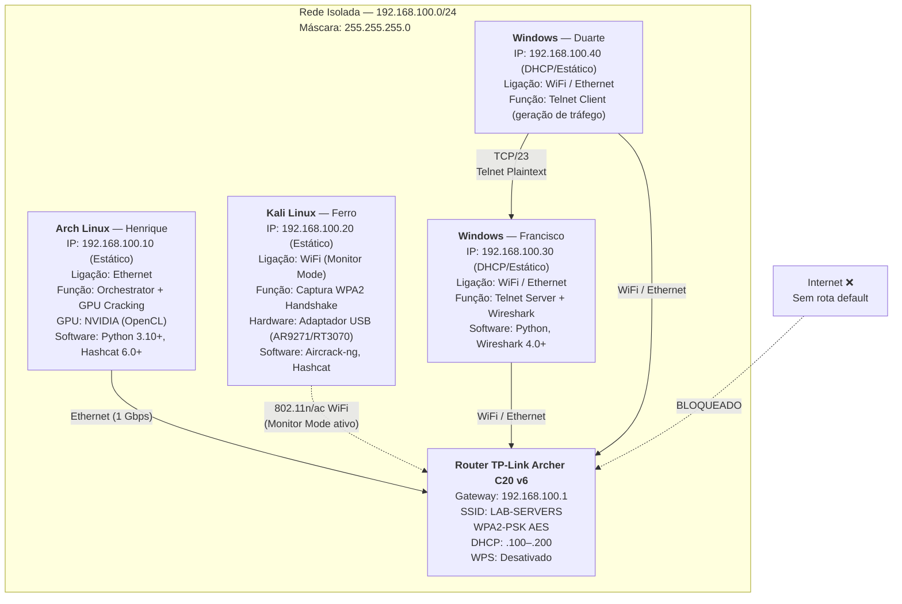
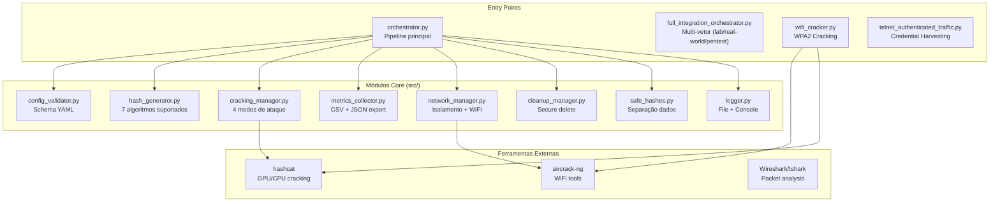
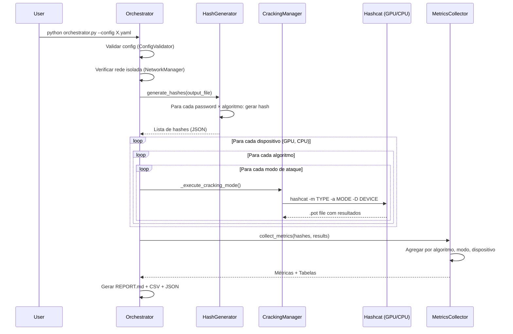
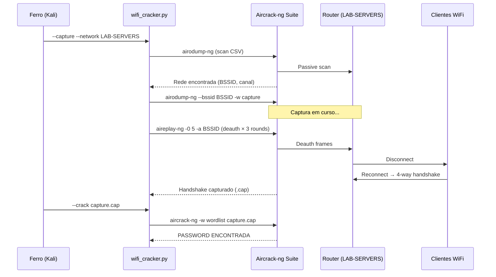

## Topologia (Resumo)

A topologia do laboratório foi pensada para ser simples, robusta e completamente isolada do tráfego externo. Os equipamentos principais ficam na sub-rede 192.168.100.0/24: um router/AP com DHCP (gateway .1), uma estação de orquestração com GPU (Arch Linux), uma máquina de captura (Kali), e dois nós Windows para gerar tráfego Telnet. O isolamento é obrigatório: não existe rota default e o NAT/forwarding fica desativado.

Principais pontos:
 - Gateway/AP: 192.168.100.1 — DHCP pool 192.168.100.100–200, WPS desligado, WPA2-PSK com chave forte temporária para demonstração.
 - Orquestrador (GPU): 192.168.100.10 — `orchestrator.py`, `hashcat` GPU, disco para resultados.
 - Captura (Kali): 192.168.100.20 — interface em monitor mode (ex: `wlan00mon`) para airodump/aireplay.
 - Telnet Server / Client (Windows): .30 / .40 — tráfego plaintext para demonstração de colheita de credenciais.

---

## Modus Operandi da Equipa

A equipa trabalhou com um fluxo leve e orientado a entregas incrementais: tarefas pequenas, branches por funcionalidade e revisões de código antes de cada merge na branch `main`. A coordenação técnica manteve uma pessoa responsável pela integração e verificação final, enquanto as restantes tarefas foram distribuídas por especialidade (captura WiFi, integração com `hashcat`, geração de métricas e documentação). Comunicação direta e testes rápidos permitiram iterar funcionalidades com rapidez, seguido de uma fase de hardening e auditoria de segurança.

Práticas adotadas:
 - Branch por feature e Pull Requests com revisão obrigatória.
 - Commits curtos e descritivos; changelog mantido manualmente em `CHANGES.md`.
 - Scripts de validação (`tools/validate_environment.py`) para reduzir erros de ambiente.
 - Logs e métricas versionados dentro de `results/` por run, com relatórios exportáveis (CSV/JSON).

---

## Network setup — passos práticos

Objetivo: criar uma rede isolada e reprodutível, configurável em redes físicas simples.

1) Configurar o router/AP
 - Desativar rota default/Internet (route, firewall ou bloquear WAN).  
 - Desativar WPS.  
 - Definir SSID (ex: `LAB-SERVERS`) e WPA2-PSK (chave temporária para a sessão).  
 - DHCP: 192.168.100.100–200; gateway 192.168.100.1.

2) Configurar Orquestrador (Arch/Linux)
 - IP estático (ex):

```bash
sudo ip addr add 192.168.100.10/24 dev eth0
sudo ip route add 192.168.100.0/24 dev eth0
```

 - Verificar ausência de default route:

```bash
ip route show | grep default || echo "No default route — isolation OK"
```

3) Configurar Captura WiFi (Kali)
 - Colocar interface em monitor mode:

```bash
sudo airmon-ng check kill
sudo airmon-ng start wlan0
# ou: sudo ip link set wlan0 down; sudo iw dev wlan0 set type monitor; sudo ip link set wlan0 up
```

 - Iniciar scan e captura:

```bash
airodump-ng wlan00mon --write captures/handshake --output-format cap
```

 - Para forçar reautenticação (deauth):

```bash
aireplay-ng --deauth 4 -a <BSSID> wlan00mon
```

4) Firewall e regras adicionais (opcional)
 - Em sistemas Linux de demonstração, bloquear forwarding e masquerade:

```bash
sudo iptables -P FORWARD DROP
sudo iptables -t nat -F
```

5) Verificação final
 - Conferir que não existe `default via` e que o router responde apenas dentro da subrede.  
 - Conferir que o `NetworkManager.verify_isolation()` do orquestrador passa sem erro.

---

## Desenvolvimento — narrativa e responsabilidade

O desenvolvimento seguiu iterações curtas com foco em funcionalidades testáveis. As fases principais foram:

1) Prova de Conceito (PoC)
 - Implementação rápida das peças individuais: gerador de hashes, integração básica com `hashcat`, captura de handshakes WiFi e módulo Telnet para geração de tráfego.

2) Integração
 - Unificação dos módulos num orquestrador, definição do schema YAML e primeiros perfis (`quick_test`, `apresentacao_final`, `real_world`).

3) Hardening e Documentação
 - Validação de isolamento de rede, limpeza segura, anonimização de logs e criação de scripts de setup para as plataformas alvo.

4) Validação e Preparação da Entrega
 - Execução de runs controlados para coletar métricas, refinamento de regras Hashcat e geração de relatórios exportáveis (CSV/JSON/REPORT.md).

Observação sobre contributos: o trabalho técnico e a integração foram conduzidos de forma concentrada por um núcleo da equipa, com contribuições específicas em funcionalidades (captura WiFi, regras, validação) e todas as etapas documentadas no repositório. Essa abordagem permitiu entregar uma plataforma coesa, reproduzível e adequada para avaliação académica.

---

Para dúvidas ou para adaptar a topologia a outra infraestrutura (ex: uso de VM, VLANs ou emulações), posso gerar um guia passo-a-passo específico para esse cenário.


# Arquitetura Técnica — HashCrackerLab

Documentação detalhada da arquitetura de rede, componentes de software e fluxos de dados do laboratório.

---

## Sumário

- [Topologia de Rede](#topologia-de-rede)
- [Endereçamento IP](#endereçamento-ip)
- [Portas e Protocolos Ativos](#portas-e-protocolos-ativos)
- [Componentes de Software](#componentes-de-software)
- [Fluxos de Dados](#fluxos-de-dados)
- [Segurança Operacional](#segurança-operacional)
- [Hardware Recomendado](#hardware-recomendado)

---


## Topologia de Rede


```mermaid
graph TB
    subgraph ISOLATED["Rede Isolada — 192.168.100.0/24<br/>Máscara: 255.255.255.0"]
        direction TB

        ROUTER["<b>Router TP-Link Archer C20 v6</b><br/>Gateway: 192.168.100.1<br/>SSID: LAB-SERVERS<br/>WPA2-PSK AES<br/>DHCP: .100–.200<br/>WPS: Desativado"]

        ARCH["<b>Arch Linux</b> — Henrique<br/>IP: 192.168.100.10 (Estático)<br/>Ligação: Ethernet<br/>Função: Orchestrator + GPU Cracking<br/>GPU: NVIDIA (OpenCL)<br/>Software: Python 3.10+, Hashcat 6.0+"]

        KALI["<b>Kali Linux</b> — Ferro<br/>IP: 192.168.100.20 (Estático)<br/>Ligação: WiFi (Monitor Mode)<br/>Função: Captura WPA2 Handshake<br/>Hardware: Adaptador USB (AR9271/RT3070)<br/>Software: Aircrack-ng, Hashcat"]

        WIN_SRV["<b>Windows</b> — Francisco<br/>IP: 192.168.100.30 (DHCP/Estático)<br/>Ligação: WiFi / Ethernet<br/>Função: Telnet Server + Wireshark<br/>Software: Python, Wireshark 4.0+"]

        WIN_CLI["<b>Windows</b> — Duarte<br/>IP: 192.168.100.40 (DHCP/Estático)<br/>Ligação: WiFi / Ethernet<br/>Função: Telnet Client (geração de tráfego)"]

        ARCH -- "Ethernet (1 Gbps)" --> ROUTER
        KALI -. "802.11n/ac WiFi<br/>(Monitor Mode ativo)" .-> ROUTER
        WIN_SRV -- "WiFi / Ethernet" --> ROUTER
        WIN_CLI -- "WiFi / Ethernet" --> ROUTER
        WIN_CLI -- "TCP/23<br/>Telnet Plaintext" --> WIN_SRV
    end

    INTERNET["Internet ❌<br/>Sem rota default"] -. "BLOQUEADO" .-> ROUTER
```


### Endereçamento IP

| Dispositivo | IP | MAC (exemplo) | Ligação | Função |
|-------------|-----|---------------|---------|--------|
| Router (Gateway) | 192.168.100.1 | — | — | Access Point + DHCP Server |
| Henrique (Arch) | 192.168.100.10 | — | Ethernet | Orchestrator + GPU Cracking |
| Ferro (Kali) | 192.168.100.20 | — | WiFi (wlan00mon) | WiFi Pentesting |
| Francisco (Win) | 192.168.100.30 | — | WiFi / Ethernet | Telnet Server + Wireshark |
| Duarte (Win) | 192.168.100.40 | — | WiFi / Ethernet | Telnet Client |
| DHCP Pool | 192.168.100.100–200 | — | — | Clientes dinâmicos |


### Portas e Protocolos Ativos

| Serviço | Porta | Protocolo | Direção | Encriptação | Observação |
|---------|-------|-----------|---------|-------------|------------|
| Telnet | TCP/23 | Telnet | .40 → .30 | **Nenhuma** (plaintext) | Intencional — demonstrar vulnerabilidade |
| WiFi | — | 802.11 WPA2 | Kali ↔ Router | AES-CCMP | Handshake capturado via monitor mode |
| DHCP | UDP/67-68 | DHCP | Router → Todos | Nenhuma | Range: .100–.200 |
| HTTP (admin) | TCP/80 | HTTP | Qualquer → Router | Nenhuma | Painel admin do router (192.168.100.1) |

> [!IMPORTANT]
> **Isolamento de rede**: Não existe rota default (`ip route del default`). O `NetworkManager` do orquestrador valida isto programaticamente antes de cada run. Nenhum tráfego sai da subrede 192.168.100.0/24.

---


## Componentes de Software


### Diagrama de Componentes


```mermaid
graph TD
    subgraph ENTRY["Entry Points"]
        ORCH["orchestrator.py<br/>Pipeline principal"]
        FULL["full_integration_orchestrator.py<br/>Multi-vetor (lab/real-world/pentest)"]
        WIFI["wifi_cracker.py<br/>WPA2 Cracking"]
        TELNET["telnet_authenticated_traffic.py<br/>Credential Harvesting"]
    end

    subgraph CORE["Módulos Core (src/)"]
        HG["hash_generator.py<br/>7 algoritmos suportados"]
        CM["cracking_manager.py<br/>4 modos de ataque"]
        MC["metrics_collector.py<br/>CSV + JSON export"]
        NM["network_manager.py<br/>Isolamento + WiFi"]
        CLN["cleanup_manager.py<br/>Secure delete"]
        CV["config_validator.py<br/>Schema YAML"]
        SH["safe_hashes.py<br/>Separação dados"]
        LOG["logger.py<br/>File + Console"]
    end

    subgraph EXTERNAL["Ferramentas Externas"]
        HC["hashcat<br/>GPU/CPU cracking"]
        AC["aircrack-ng<br/>WiFi tools"]
        WS["Wireshark/tshark<br/>Packet analysis"]
    end

    ORCH --> CV
    ORCH --> HG
    ORCH --> CM
    ORCH --> MC
    ORCH --> NM
    ORCH --> CLN
    ORCH --> SH
    ORCH --> LOG

    CM --> HC
    WIFI --> AC
    WIFI --> HC
    NM --> AC
```


### Módulos Detalhados

#### `orchestrator.py` — Motor Principal

Coordena o pipeline completo: validação → geração → cracking → métricas → relatório → limpeza.

| Fase | Componente | Operação |
|------|-----------|----------|
| 1/6 | `NetworkManager` | Verificar isolamento de rede (se configurado) |
| 2/6 | `HashGenerator` | Gerar N × M hashes (N passwords × M algoritmos) |
| 3/6 | `CrackingManager` | Executar K modos de ataque em cada dispositivo (GPU/CPU) |
| 4/6 | `MetricsCollector` | Agregar resultados por algoritmo, modo e dispositivo |
| 5/6 | `_generate_report()` | Exportar REPORT.md + CSV + JSON |
| 6/6 | `CleanupManager` | Limpeza segura (se `auto_cleanup: true`) |

Extras (pós-cracking):
- **WPA2 GPU Demo**: benchmark de hashcat mode 22000 contra `hashes/wifi_sample.hc22000`
- **Brute-force Concept**: simulação visual de PIN 0000–9999 em Python

#### `hash_generator.py` — Gerador Determinístico

Suporta 7 algoritmos com geração determinística (seed + salts fixos):

| Algoritmo | Implementação | Salt | Parâmetros Configuráveis |
|-----------|--------------|------|--------------------------|
| MD5 | `hashlib.md5` | Opcional | — |
| SHA-1 | `hashlib.sha1` | Opcional | — |
| SHA-256 | `hashlib.sha256` | Opcional | — |
| Bcrypt | `bcrypt.hashpw` | Automático | `cost` (rounds) |
| Scrypt | `passlib.hash.scrypt` | Automático | `n`, `r`, `p` |
| PBKDF2-SHA256 | `passlib.hash.pbkdf2_sha256` | Automático | `iterations` |
| Argon2id | `argon2.low_level.hash_secret_raw` | Configurável | `cost` (memory KB), `iterations` |

Formato de salt para hashes salted: `hash($salt.$password)` — corresponde aos modos hashcat 20 (MD5), 120 (SHA-1), 1420 (SHA-256).

#### `cracking_manager.py` — Interface Hashcat

Resolve automaticamente o path do hashcat (Linux direto, Windows via `%HASHCAT_PATH%`, Chocolatey, ou caminhos comuns).

| Modo de Ataque | Flag Hashcat | Implementação |
|----------------|-------------|---------------|
| Dictionary | `-a 0` | `_run_dictionary_attack()` — suporta rules opcionais |
| Brute-force | `-a 3` | `_run_bruteforce_attack()` — máscara configurável |
| Combinator | `-a 1` | `_run_combinator_attack()` — 2 wordlists |
| Hybrid | `-a 6` / `-a 7` | `_run_hybrid_attack()` — wordlist + máscara (ou reverso) |

Seleção de dispositivo via flag `-D`: `1` = CPU, `2` = GPU (OpenCL).

Cada execução produz um `.pot` file separado por algoritmo + modo, permitindo contagem precisa de crackeados.

#### `cleanup_manager.py` — Segurança de Dados

Implementa limpeza segura em 3 passos:
1. **Zeros** — Sobrescrever com `\x00`
2. **Uns** — Sobrescrever com `\xFF`
3. **Aleatório** — Sobrescrever com `os.urandom()`
4. **Unlink** — Remover ficheiro

Adicionalmente:
- Anonimiza logs (remove IPs privados, MACs, possíveis passwords)
- Calcula checksums SHA-256 antes e depois da limpeza
- Gera `CLEANUP_REPORT.json` com auditoria completa

---


## Configuração YAML


### Schema

```yaml
experiment:
  name: string            # Identificador da experiência
  description: string     # Descrição livre
  seed: int | null        # Seed para reprodutibilidade (null = aleatório)
  deterministic_salts: bool  # Salts derivados da seed

  hash_generation:
    count: int            # Número de passwords a gerar hashes
    algorithms:           # Lista de algoritmos
      - name: string      # md5|sha1|sha256|bcrypt|scrypt|pbkdf2_sha256|argon2
        salt: bool        # Habilitar salt (md5/sha1/sha256)
        cost: int         # Cost factor (bcrypt/argon2)
        iterations: int   # Iterações (argon2/pbkdf2)
    password_patterns:    # Lista de passwords ou padrões
      - string

  cracking:
    modes:                # Modos de ataque sequenciais
      - type: string      # dictionary|brute-force|combinator|hybrid
        wordlist: string  # Path para wordlist
        rules: string     # Path para ficheiro de regras (opcional)
        mask: string      # Máscara hashcat (brute-force/hybrid)
        max_time: int     # Timeout em segundos
    workers:
      gpu:
        enabled: bool
      cpu:
        enabled: bool

  wifi:                   # Configuração WiFi (opcional)
    enabled: bool
    interface: string     # Ex: wlan00mon
    target_ssid: string
    capture_time: int

  security:
    isolated_network: bool   # Exigir rede isolada
    auto_cleanup: bool       # Limpeza automática após run
    cleanup_delay: int       # Delay antes da limpeza (segundos)

  output:
    base_dir: string      # Template: results/{experiment_name}_{timestamp}
    export_formats: list  # csv, json
```


### Perfis Incluídos

| Perfil | `count` | Algoritmos | Modos | GPU | CPU | `isolated_network` |
|--------|---------|-----------|-------|-----|-----|---------------------|
| `quick_test` | 3 | 4 | 1 (dict) | ✅ | ❌ | ❌ |
| `apresentacao_final` | 15 | 4 | 5 | ✅ | ✅ | ✅ |
| `real_world` | 100 | 4 | 5 | ✅ | ✅ | ✅ |

---


## Fluxos de Dados


### Hash Cracking Pipeline


```mermaid
sequenceDiagram
    participant User
    participant Orch as Orchestrator
    participant HG as HashGenerator
    participant CM as CrackingManager
    participant HC as Hashcat (GPU/CPU)
    participant MC as MetricsCollector

    User->>Orch: python orchestrator.py --config X.yaml
    Orch->>Orch: Validar config (ConfigValidator)
    Orch->>Orch: Verificar rede isolada (NetworkManager)
    Orch->>HG: generate_hashes(output_file)
    HG->>HG: Para cada password × algoritmo: gerar hash
    HG-->>Orch: Lista de hashes (JSON)

    loop Para cada dispositivo (GPU, CPU)
        loop Para cada algoritmo
            loop Para cada modo de ataque
                Orch->>CM: _execute_cracking_mode()
                CM->>HC: hashcat -m TYPE -a MODE -D DEVICE
                HC-->>CM: .pot file com resultados
            end
        end
    end

    Orch->>MC: collect_metrics(hashes, results)
    MC->>MC: Agregar por algoritmo, modo, dispositivo
    MC-->>Orch: Métricas + Tabelas
    Orch->>Orch: Gerar REPORT.md + CSV + JSON
```


### WiFi WPA2 Attack Flow


```mermaid
sequenceDiagram
    participant Ferro as Ferro (Kali)
    participant WC as wifi_cracker.py
    participant Air as Aircrack-ng Suite
    participant Router as Router (LAB-SERVERS)
    participant Clients as Clientes WiFi

    Ferro->>WC: --capture --network LAB-SERVERS
    WC->>Air: airodump-ng (scan CSV)
    Air->>Router: Passive scan
    Air-->>WC: Rede encontrada (BSSID, canal)

    WC->>Air: airodump-ng --bssid BSSID -w capture
    Note over Air,Router: Captura em curso...

    WC->>Air: aireplay-ng -0 5 -a BSSID (deauth × 3 rounds)
    Air->>Router: Deauth frames
    Router->>Clients: Disconnect
    Clients->>Router: Reconnect → 4-way handshake
    Air-->>WC: Handshake capturado (.cap)

    Ferro->>WC: --crack capture.cap
    WC->>Air: aircrack-ng -w wordlist capture.cap
    Air-->>WC: PASSWORD ENCONTRADA
```

---


## Segurança Operacional


### Medidas Implementadas

| Camada | Mecanismo | Implementação |
|--------|-----------|---------------|
| **Rede** | Isolamento total | `NetworkManager.verify_isolation()` — rejeita runs se `default via` existir |
| **Dados** | Separação hashes/passwords | `SafeHashesManager` — versão safe (sem passwords) + ficheiro `.passwords` separado |
| **Limpeza** | 3-pass secure delete | `CleanupManager._secure_delete()` — zeros → uns → random → unlink |
| **Logs** | Anonimização automática | Regex remove IPs, MACs, passwords de ficheiros de log |
| **Auditoria** | Checksums SHA-256 | Calculados antes e depois da limpeza, guardados em `CLEANUP_REPORT.json` |
| **Config** | Validação de schema | `ConfigValidator` — rejeita configs inválidas antes de executar |

> [!IMPORTANT]
> O ficheiro `.passwords` gerado durante cada run contém passwords em plaintext e é marcado para eliminação. Nunca deve ser commitado no Git — está incluído no `.gitignore`.

---


## Hardware Recomendado

### Mínimo

| Componente | Especificação |
|------------|--------------|
| RAM | 4 GB |
| Disco | 10 GB livres (wordlists + resultados) |
| CPU | Qualquer x86-64 |
| GPU | Não obrigatória (CPU mode disponível) |

### Para Demonstração Completa

| Componente | Especificação | Função |
|------------|--------------|--------|
| GPU NVIDIA | GTX 1060+ com OpenCL | Aceleração de cracking (6–16× vs CPU) |
| Adaptador WiFi USB | Chipset AR9271 / RT3070 / RTL8812AU | Monitor mode + packet injection |
| Router WiFi | Qualquer com WPA2-PSK | Access Point alvo |
| Switch / Cabos Ethernet | Opcional | Ligação com fios para Arch Linux |
